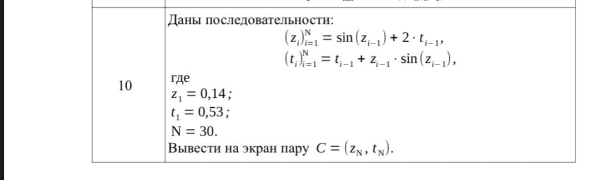

# CW2_Kongdi

Control work #2. 10 variant.

<h1>Control work #2</h1>
<h3>Task 1. Recurrent sequences</h3>

Develop a program for calculating the recurrent sequence
and displaying the result on the screen, taking into account the additional conditions
of the task variant. The software solution of the task should not use
arrays, i.e. arrays are forbidden to use. The task options
are presented in Table 4.

